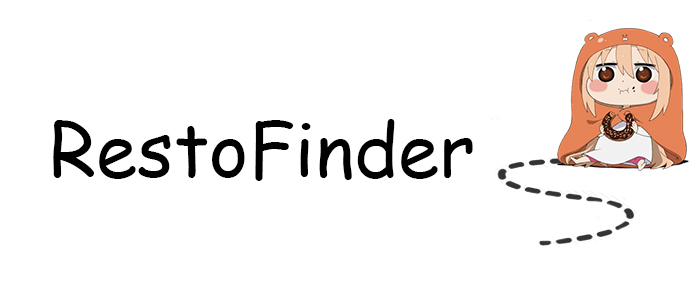

<p align="center"></p>

RestoFinder is a Laravel based web application for random restaurant discovery.

## Development Setup
### Linux
For development on Linux follow these steps
1. Install all prerequisites
```sudo apt-get install php7.2 php7.2-xml php7.2-gd php7.2-opcache php7.2-mbstring php-mysql nodejs npm composer```
2. Clone this git
```git clone git@csil-git1.cs.surrey.sfu.ca:jkchung/T-Khaki.git```
3. Rename env.txt to .env
```mv env.txt .env```
4. Run composer install
```composer install```
5. Update npm
```npm update```
6. Generate key
```php artisan key:generate```
7. Build RestoFinder
```npm run dev```
8. Make copy of environment.php.example as environment.php and paste Yelp API key inside
9. Setup local MySQL server
```sudo ./database/dbsetup.sh``` 
10. Run artisan serve
```php artisan serve```
11. Navigate to http://localhost:8000

### Everything Else
For Everything else
1. Install prerequisites. 
https://nodejs.org/en/
http://php.net/downloads.php
https://getcomposer.org/download/
2. Follow steps 2 to 11 from linux setup

### Updating from a git pull
When you pull a new commit make sure to update composer and npm
1. composer update
```composer update```
2. npm update
```npm update```

### Basic Folder Structure
The Front End Portion of the project can be found under 'resources/js'. This is where the react applications live.
For most server side endpoints, they are inside 'public'.
*e.g. Database endpoints are inside 'public/database'*

## Deployment
Deployment instructions are for apache2 on a linux server.
1. Install all prerequisites
```sudo apt-get install apache2 libapache2-mod-php7.2 php7.2 php7.2-xml php7.2-gd php7.2-opcache php7.2-mbstring php-mysql composer```
2. Clone this git to either ```/var/www/html/``` or make a link to this directory
```git clone git@csil-git1.cs.surrey.sfu.ca:jkchung/T-Khaki.git```
3. Rename env.txt to .env
```mv env.txt .env```
4. Run composer install
```composer install```
5. Update npm
```npm update```
6. Generate key
```php artisan key:generate```
7. Build RestoFinder
```npm run prod```
8. Make copy of environment.php.example as environment.php and paste **Yelp API key** and **database server address** inside
9. Change permissions of project directory
```sudo chgrp -R www-data /var/www/html/T-Khaki```
```sudo chmod -R 775 /var/www/html/T-Khaki/storage```
10. Create a ```laravel.conf``` file for apache2 in ```/etc/apache2/sites-available``` with contents below
```
<VirtualHost *:80>
    ServerAdmin webmaster@localhost
    DocumentRoot /var/www/html/T-Khaki/public

    <Directory /var/www/html/T-Khaki>
        AllowOverride All
    </Directory>

    ErrorLog ${APACHE_LOG_DIR}/error.log
    CustomLog ${APACHE_LOG_DIR}/access.log combined
</VirtualHost>
```
11. Reconfig apache2 with new config files
```sudo a2dissite 000-default.conf```
```sudo a2ensite laravel.conf```
```sudo a2enmod rewrite```
```sudo service apache2 restart```
12. Navigate to server ip and check if RestoFinder is up

### Setup Database
1. clone git and run the follow line
```sudo ./database/dbsetup.sh```

## About Laravel

Laravel is a web application framework with expressive, elegant syntax. We believe development must be an enjoyable and creative experience to be truly fulfilling. Laravel attempts to take the pain out of development by easing common tasks used in the majority of web projects, such as:

- [Simple, fast routing engine](https://laravel.com/docs/routing).
- [Powerful dependency injection container](https://laravel.com/docs/container).
- Multiple back-ends for [session](https://laravel.com/docs/session) and [cache](https://laravel.com/docs/cache) storage.
- Expressive, intuitive [database ORM](https://laravel.com/docs/eloquent).
- Database agnostic [schema migrations](https://laravel.com/docs/migrations).
- [Robust background job processing](https://laravel.com/docs/queues).
- [Real-time event broadcasting](https://laravel.com/docs/broadcasting).

Laravel is accessible, yet powerful, providing tools needed for large, robust applications.

### Learning Laravel

Laravel has the most extensive and thorough [documentation](https://laravel.com/docs) and video tutorial library of any modern web application framework, making it a breeze to get started learning the framework.

If you're not in the mood to read, [Laracasts](https://laracasts.com) contains over 1100 video tutorials on a range of topics including Laravel, modern PHP, unit testing, JavaScript, and more. Boost the skill level of yourself and your entire team by digging into our comprehensive video library.

## React Semantic UI

Documentation for React Semantic UI can be found [here](https://react.semantic-ui.com/)